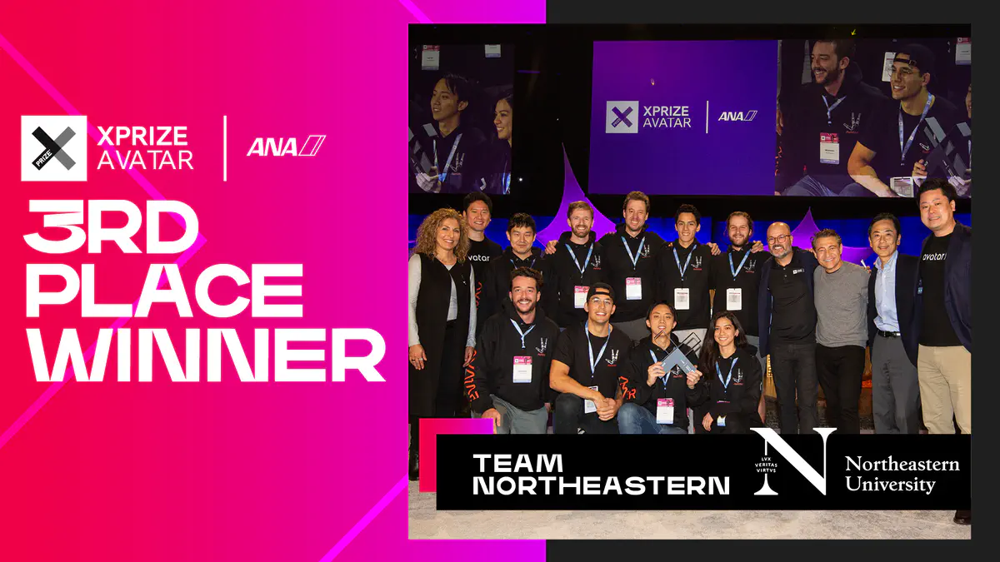

Welcome to Avatar's documentation!
===================================

All the technical documentation of the Northeastern Avatar robot is host here.
For more stories of the system and our amazing team, please refer to our 
`project website <https://robot.neu.edu/project/avatar/>`_.

For avatar system start-up instructions, please refer to :doc:`/instructions`.

You can check how to bleed the system properly at :ref:`bleed-system`.

You can check how to start the video system at :ref:`video-instructions-avatar`.

.. note::

   This project is under active development.

Contents
--------

.. toctree::

   instructions
   mechanical
   control
   network
   mobile_base

